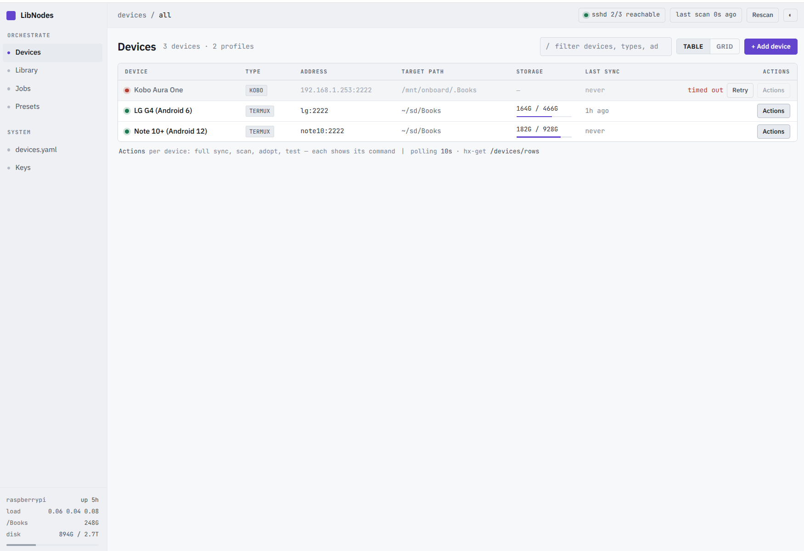
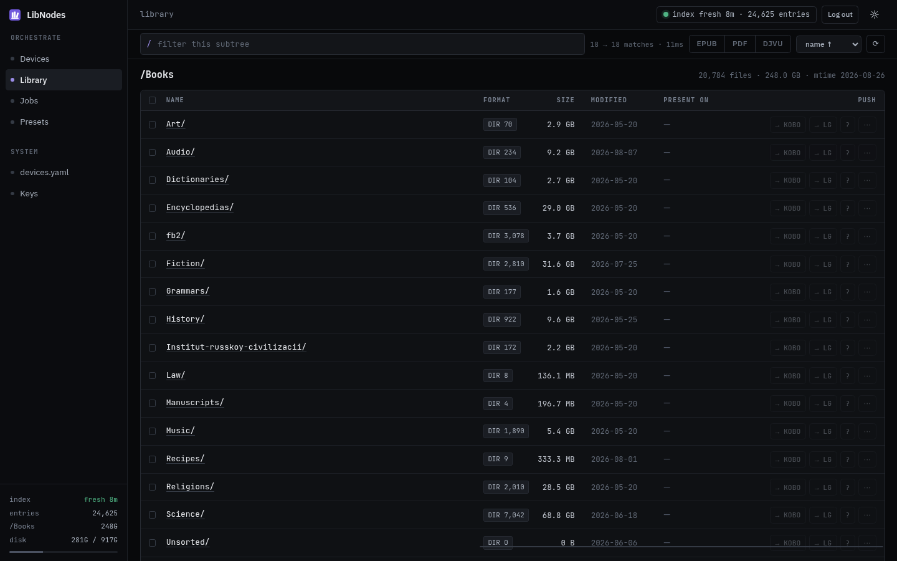

# LibNodes

Pushes selected parts of a large book library out to a fleet of reading devices —
Kobo/KOReader over dropbear, Android/Termux, plain Linux hosts — over `ssh` + `rsync`,
and keeps a cached view of what each device already holds.

Built on a Raspberry Pi 3 against a 250 GB library, so the constraints are real: never walk
the library in a request, never probe a device in one, and 60 MB of RSS. It runs on a Pi 5
now, which makes it quick rather than different — the constraints stayed, because the ones
worth keeping were never about the hardware.

FastAPI + Jinja2 + HTMX. No client framework, no build step, no Node, no ORM.

```bash
uv pip sync requirements-dev.txt
uv run pytest
sudo systemctl restart libnodes                # then http://pi5:8090/devices
```

Development happens on the Pi itself, in the tree the service runs from, so there is no
deploy step and no dev server — see [`deploy/README.md`](deploy/README.md) for the host, and
`CLAUDE.md` for the loop.

## What it looks like

**Devices** — every device from `devices.yaml`, whether it answers right now, how much
room is left on it, and one menu of actions per device. Reachability is a cached
background probe, so an unreachable e-reader costs the page nothing.



**Library** — one panel, served from a SQLite index rather than a live `stat()` walk, so
filtering 20,000 entries stays interactive on a Pi. The file table is the navigator: a
directory's name opens it, the rest of the row ticks it for a push, and the breadcrumb
goes back up — which is what makes the view usable on a tablet, where a separate tree pane
had nowhere to go. `PRESENT ON` shows which devices already hold each item, and hovering a
chip says when we last had evidence for it. Both a dark and a light theme are built in.



## The one thing to know about the library

It is **content-addressed**. Every book in the browsable tree is a symlink into a vault
of blake2b-named blobs:

```
/Books/Science/Philology/Scheffer-…-2022.pdf -> ../../.data/b50cc577e28f4d3e…
```

`find -type f` therefore returns zero books, and a plain `rsync -a` copies dangling
symlinks that an e-reader will happily display as zero-byte files. Two consequences run
through the whole codebase:

- **`rsync -L` is mandatory**, and not configurable. Getting it wrong produces a
  transfer that reports success and delivers nothing.
- **The blob hash is a free content identity.** The index records it and manifests
  compare it, so "is the device's copy stale?" has an exact answer rather than an
  mtime/size guess.

If your library is an ordinary tree of real files, none of this hurts: `-L` on a
non-symlink is a no-op.

## The rsync flags belong to the program

`devices.yaml` describes *devices*, not rsync invocations. LibNodes builds the command
itself because it depends on the exact behaviour of the flags:

| Flag | Why |
|---|---|
| `-L` | the library is symlinks into a CAS vault — **except on a mirror**, below |
| `-R` | a source keeps its path shape on the device |
| `--out-format=@%l\|%n` | file events are declared, so parsing is exact rather than a guess about which lines look like filenames |
| `--info=progress2,flist0,misc0,stats1` | one aggregate progress line; no chatter we would only have to filter |
| `-O` | otherwise rsync stamps every directory's mtime and reports each as touched |
| `--no-perms` | **only** where the target filesystem cannot store them |
| `--modify-window=1` | **only** on FAT, whose seconds field counts in twos |
| `--size-only --no-times` | **only** where the target cannot store an mtime at all |
| `--delete` | **only** on a mirror, where a stale leftover is a divergence |

Those last four are why devices declare facts — `fs:` (vfat, exfat, ext4, …),
`stores_times:` and `sync_mode:` — rather than a flag list: the filesystem, the mount and
the node's purpose are the actual constraints, and device type is only a proxy for any of
them. A Linux host with an exFAT
disk gets FAT treatment; an ext4 target keeps full archive semantics. See `FS_PROFILES` in
`models.py`.

`stores_times: false` is the narrowest of these and the least obvious. Android's
*emulated* storage — `/sdcard`, `/storage/emulated/0` — is not a filesystem but a FUSE
shim with nothing underneath, and its daemon has no `utimensat`: it returns EPERM even to
root. rsync's quick check is size+mtime, so a destination whose mtime is always the moment
of transfer can *never* match, and every push re-sends the whole selection while ending in
exit 23. Neither flag fixes it alone: `--no-times` still re-sends, `--size-only` still
tries to stamp and still exits 23. The pair is clean. Measured on nexus10 — an unchanged
push went from 2 files and 33,531 bytes of wire, three attempts and a red banner, to 0
files, 284 bytes, exit 0.

It describes the *target path*, not the platform and not the filesystem, which is why it
is its own key. A physical card is the other Android case and works fine: `lg`'s `~/sd` is
a symlink to `/storage/D94C-6302/…`, a 466 GB vfat volume vold mounts with `allow_utime`,
and `touch -t` succeeds there. So two `fs: vfat` Android nodes disagree, and the one that
fails is not writing to a filesystem at all. Test the target, not the device.

Deliberately absent: `-h` (we format numbers ourselves), `%i` in the out-format (it
makes rsync log every unchanged file on a FAT target — 24,616 lines around 4 real
transfers, measured), and `--size-only` on an ordinary push — it belongs to Adopt and to
a node that has declared it cannot store the alternative, and to nothing else. See below.

### Two shapes: readers and mirrors

Every device was a *reader* until a Linux box needed the other thing. A reader wants the
books; a replica wants the tree. `sync_mode:` in `devices.yaml` picks which, and nothing
else does — not `type:`, because a Linux host is entitled to either.

| | `books` (default) | `mirror` |
|---|---|---|
| symlinks | dereferenced (`-L`) into real files | kept as symlinks |
| `.data/` | never named; `-L` reads *through* it | **sent**, or every link dangles |
| `urantia-library/` | never sent | sent, credentials and all |
| `Recommended/` | never sent — `-L` would duplicate every book in it | sent; as links it is nearly free |
| deletes | never | `--delete`, always |
| granularity | any subtree, any book | the whole root, or nothing |

The two rows in the middle are the interesting ones, because each inverts a rationale that
holds perfectly well for a reader:

- `.data/` is excluded from *browsing* so the vault is not a directory you can wander
  into, while remaining the thing `-L` dereferences. A mirror keeps the symlinks, so for
  it the vault stops being permitted and becomes **mandatory** — omit it and you have
  delivered exactly the dangling links `-L` exists to prevent, arrived at from the
  opposite direction.
- `Recommended/` is excluded *because of* `-L`: its entries are companion symlinks to
  books that already live elsewhere, so dereferencing would ship a second full copy of
  every recommended book. Preserve the links and that cost disappears.

A mirror is not offered in the Library view's push targets. A subtree of preserved
symlinks has no vault to resolve against, and the index cannot offer `.data/` as something
to select — so it would only ever be a way to build the dangling-link failure by hand. It
gets one **Replicate** action on its device row instead, and a **Dry run** beside it that
is the only preview of what `--delete` would remove.

### Why a mirror is one source, `./`

`--delete` only prunes directories that are part of the transfer. Hand rsync the top-level
names — `.data/ Science/ urantia-library/ …` — and it tidies *inside* each of them while
never once scanning the destination root, so anything that exists only on the device and
does not share a name with a source survives every replicate for ever. Measured on a local
pair: the enumerated form left a stray `Leftover.pdf` and a whole orphaned `OldCat/`
untouched; `./` removed both. So a mirror sends `./` and `-R` makes the transfer root the
destination root, which is what "replica" has to mean.

The job still *records* the enumerated top-level names as its sources, because that is what
the estimate prices and the manifest records — collapse those to `./` too and a replicate
updates no manifest at all, leaving `PRESENT ON` permanently blank. The two lists are
different on purpose: one is what rsync is told, the other is what the app reasons about.

Scanning a mirror is the one case where a scan is the *stronger* claim rather than a weaker
one. `rsync --list-only` normally reports size and mtime, never content — but with `-l` it
prints a symlink's target, and that target is the blob hash. So a mirror's listing answers
"is this the same book?" exactly, which is the comparison `manifests._compare` prefers and
a reader's scan can never reach.

### Why FAT needs a modify window

FAT stores the seconds field of an mtime in units of two, so a timestamp rsync writes
reads back up to a second early: `75-ores.mp3` went out at 09:37:25 and comes back
09:37:24. rsync 3.1.3 compares mtimes exactly, calls the file changed, and re-sends it —
on every push, for ever. Measured on the FAT32 card in a real Android phone: **8,786 of
24,620 files** wanted re-sending, and `--modify-window=1` took that to **0**. One second,
not two, because rounding to an even second moves a timestamp by at most one and rsync's
window is symmetric.

The window is per-filesystem, not global, because on ext4 the timestamps are exact and
the exact comparison is what notices a book edited in place.

### Why a push is not `--size-only`

Every other size-and-mtime mismatch is real, so a push keeps rsync's default check.
Measured on the same device: a dry run over the whole 266 GB library named 4 files out of
24,620, `speedup 272,845` — exactly the four the `PRESENT ON` badge counted as missing.
`--size-only` would match on size and skip a book whose content changed underneath us,
which is the silent divergence the blob-hash manifest exists to catch.

Note that a re-send is cheaper than it looks even when it happens: rsync's delta
algorithm reconstructs the file from the copy the device already holds. One measured push
reported 98 files and 4.38 GB while putting **6.7 MB** on the wire, `speedup 1,482`. The
dock shows both numbers, because only one of them is what your WiFi carried.

## Adopting a device that already has the library

A device populated by other means is invisible to LibNodes, and worse, looks entirely
out of date: its files carry the mtimes of whenever they were copied, so rsync's
size+mtime check wants to re-send all of them. Two actions fix that, both under
**Actions** on the device row:

- **Scan** — `rsync --list-only` over the target, recording what is there. 20,782 files
  in 35 s on a real Android device over WiFi.
- **Adopt** — a `--size-only` run. rsync skips files whose size already matches but
  still repairs their timestamps, so nothing is transferred and every later sync is
  incremental. Measured: 266 GB library reconciled in 76 s, 258 MB sent (the files
  genuinely missing), after which a normal sync itemises nothing.

Every action shows the command it will run, because an action whose effect you have to
infer from its label is a bad action.

## Layout

| Module | Responsibility |
|---|---|
| `config.py` | settings; `devices.yaml` load, validate, watch |
| `models.py` | the `devices.yaml` schema, filesystem profiles, YAML→line mapping |
| `library.py` | SQLite index: the walk, the queries, the path guard |
| `probe.py` | cached reachability and free-space probes, with backoff |
| `jobs.py` | job store, rsync runner, progress parser, failure hints |
| `procs.py` | subprocess teardown: terminate, wait, release the pipes |
| `manifests.py` | what each device holds; `PRESENT ON` and staleness |
| `scan.py` | remote listing, and recovery of mangled filenames |
| `auth.py` | the shared-password lock: signed cookie, middleware, what stays open |
| `watch.py` | inotify on `devices.yaml`, so edits appear without polling |
| `host.py` | `/proc` telemetry for the rail footer |
| `yamlview.py` | token colouring for the read-only config view |
| `routes/` | one module per view; full pages return the shell, everything else a fragment |

Outside the package, `tools/shot.py` photographs and interrogates the running UI over the
DevTools protocol — the Pi has no display, so it is how the UI is looked at at all.

`static/app.css` is hand-written, not generated: its custom-property names mirror the
Tailwind theme of the design bundle this UI was built from, so the two stay
cross-readable. That bundle is not in the repository — it has been implemented, and the
code is the artefact. Fonts are self-hosted (`static/fonts/regenerate.py` refetches
them) so the machine works on an isolated LAN.

## Design rules worth not breaking

- **Nothing blocks.** A push returns immediately and streams into the dock over SSE. The
  one blocking dialog in the app is the offline-push confirmation.
- **Requests never probe a device.** A background task writes reachability into a dict;
  handlers read it. Otherwise six sleeping e-readers become a six-second page load.
- **Never walk the library in a request.** The file list and breadcrumb come from the
  index; a rebuild runs on one background thread and publishes by atomic rename.
- **Concurrency is the host's to declare, and defaults to one.** On the Pi 3 the NIC shared
  the USB bus with the library disk, so two transfers did not go twice as fast — they went
  half as fast each. On the Pi 5's NVMe (430 MB/s measured) and gigabit that reason is gone
  and the deployment sets three; the code default stays one, for a host that has not said.
- **Every template except `base.html` and the page templates must render standalone.**
  That is the HTMX contract; `test_fragments_render_standalone` enforces it.
- **An exit code is read, not trusted.** rsync spends 23 on both "some files were not
  transferred" and "some attrs were not transferred", and on an Android target it is
  always the second — `/sdcard` is a FUSE mount whose daemon has no `utimensat`, so every
  push there delivers every byte and still ends 23. Read as failure it drew a red banner,
  recorded a partial manifest and retried the whole transfer twice. `is_attrs_only` reads
  rsync's own diagnostics to tell the two apart.

## Locking it

LibNodes binds `0.0.0.0` and every button on it drives real hardware, so set
`LIBNODES_PASSWORD` and it asks for one shared password, once per browser, and keeps a
signed cookie. Leave it unset and there is no login at all — convenient for a dev server,
and the service says so at startup rather than pretending.

The cookie is signed with a key derived from the password, so changing the password logs
everyone out and there is no session store to keep. `/static` and `/healthz` stay open
deliberately: the login page needs the first, and the post-restart health check polls the
second.
`deploy/README.md` §Access says where to put the password on the Pi — `/etc/default/libnodes`,
not `.env`, which an rsync deploy to another host would delete.

## Testing notes

514 tests, ~20 s on the Pi 5, no network required. Two fixtures encode lessons that cost
real debugging:

- `tests/data_rsync_human.log` — verbatim output from a real transfer. `-avhP` includes
  `-h`, so rsync reported `734.38K` rather than `1,234,567`, and a parser tested only
  against hand-written fixtures reported 0 bytes for every genuine transfer.
- The library fixture builds a real CAS tree — symlinks into a blob directory, including
  a dangling one — because that shape is what most of the interesting behaviour depends
  on.

When a change is visual, assert on computed style or a screenshot. Asserting that
`element.hidden` was set once passed happily while the UI was visibly broken, because a
`display: flex` rule outranks the UA's `[hidden]`. The Pi has no display, so
`tools/shot.py` does this against the running service — headless chromium over the DevTools
protocol, a PNG or a `getComputedStyle` answer; `tests/test_theme.py` covers the palette by
parsing `app.css`, which needs no browser.

## Status

Working: devices with live reachability, library explorer with instant filter, pushes to
one or many devices, live SSE progress dock, job history with logs, scan/adopt, dry runs,
read-only `devices.yaml` view with inotify refresh, light and dark themes, responsive
layout for tablets, optional shared-password login.

Not built yet: the device configuration drawer (edit `devices.yaml` by hand for now —
changes take effect immediately), presets, wake-on-LAN.
